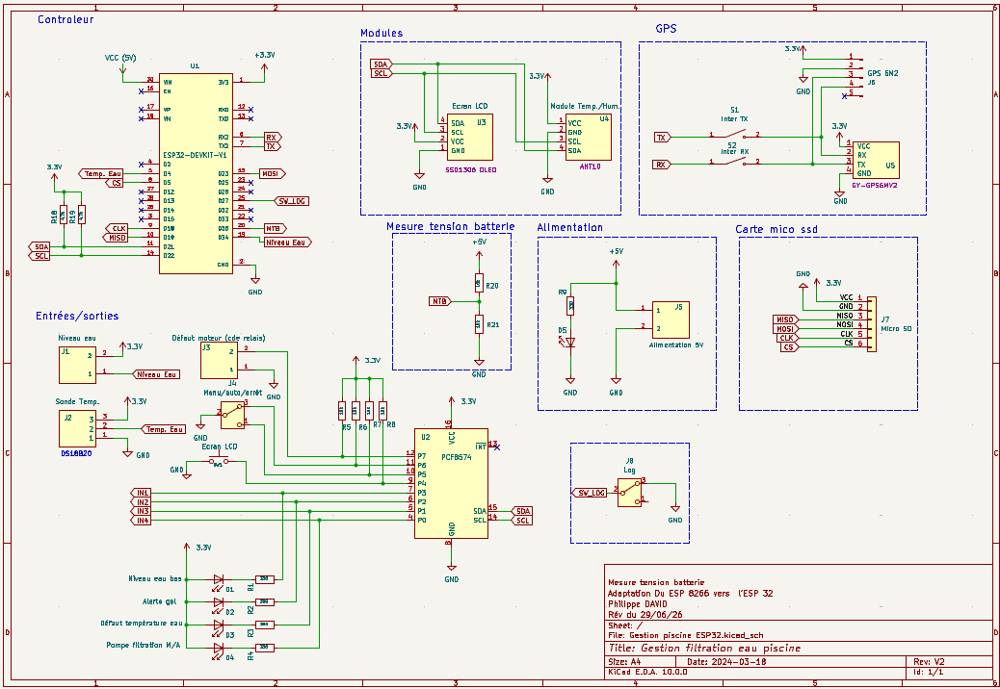

# Gestion de filtration piscine — ESP32 / Rust


Système domotique embarqué qui pilote la pompe de filtration d'une piscine
familiale : température de l'eau, sécurités matérielles, planification
automatique, tableau de bord web, suivi cloud. Écrit en Rust sur ESP32
(`esp-idf-hal` / `esp-idf-svc`), portage et évolution d'un projet
C++/PlatformIO de référence.

## Sommaire

- [Aperçu](#aperçu)
- [Fonctionnalités](#fonctionnalités)
- [Architecture matérielle](#architecture-matérielle)
- [Organisation des fichiers](#organisation-des-fichiers)
- [Démarrage](#démarrage)
- [Tableau de bord web](#tableau-de-bord-web)
- [État du projet](#état-du-projet)
- [Licence](#licence)

## Aperçu

Le montage pilote une pompe de filtration selon trois modes sélectionnables
par un interrupteur physique — **AUTO** (durée de filtration calculée selon la
température de l'eau, dans une plage horaire configurable), **MANUEL**
(marche/arrêt à la demande) et **OFF** — avec un jeu de sécurités matérielles
(niveau d'eau, défaut moteur, anti-gel, canicule) qui prennent le pas sur
n'importe quel mode en cas de besoin. Un serveur web embarqué directement sur
l'ESP32 sert un tableau de bord en temps réel, sans dépendance à un service
externe pour fonctionner au quotidien.

## Fonctionnalités

- **Trois modes de fonctionnement** (interrupteur physique 3 positions) : AUTO,
  MANUEL (bouton ou page web), OFF.
- **Sécurités matérielles** : niveau d'eau, défaut moteur (disjoncteur),
  anti-gel, canicule, anti-claquement du relais (protection contre un cyclage
  trop rapide).
- **Task Watchdog** : tout blocage de plus de 5 s de la boucle principale
  déclenche un redémarrage automatique et journalisé, plutôt qu'un blocage
  total silencieux.
- **Tableau de bord web embarqué**, servi directement par l'ESP32 : température
  eau/air, humidité, état pompe, mode, position GPS, tension batterie, timeline
  colorée des modes de la journée (avec trace réelle de la marche pompe),
  marche forcée, réglage de la plage horaire, consultation des journaux
  (sessions pompe, bilans journaliers, alertes).
- **Journalisation persistante** (NVS) : sessions pompe, bilans journaliers,
  alertes, et compteurs du jour — survivent aux redémarrages.
- **Suivi cloud** vers [Adafruit IO](https://io.adafruit.com) : envoi groupé de
  toutes les mesures en une seule requête HTTP par cycle, dans un fil
  d'exécution dédié, jamais dans la boucle principale surveillée par le
  watchdog.
- **Horodatage GPS avec repli NTP** : heure fiable même sans réseau Wi-Fi.
- **Suivi de l'alimentation batterie/solaire** (en cours de câblage) : deux
  ponts diviseurs de tension pour surveiller la batterie 12V et la sortie
  régulée 5V d'un contrôleur de charge solaire.

## Architecture matérielle

| Bus / broche | Composant | Rôle |
| --- | --- | --- |
| I2C (GPIO21 SDA, GPIO22 SCL, 400 kHz) | AHT10 (0x38) | Température / humidité air |
| I2C | PCF8574 (0x21) | Expandeur de broches (relais, boutons, interrupteur de mode) |
| I2C | SSD1306 (0x3C) | Écran OLED de diagnostic |
| 1-Wire (GPIO4) | DS18B20 | Température de l'eau |
| UART2 (GPIO16 RX) | Module GPS | Horodatage et coordonnées |
| ADC1 (GPIO34) | Détecteur de niveau | Sécurité niveau d'eau |
| ADC1 (GPIO32, GPIO35) | Ponts diviseurs | Tension batterie 12V / sortie solaire 5V |

Détail du câblage du PCF8574 : P0 pilote le relais pompe, P3 le relais de
défaut système, P4/P5/P6 lisent respectivement le bouton écran et
l'interrupteur de mode (MANU/AUTO), P7 lit le retour de défaut moteur.



Schéma KiCad complet du montage. Il inclut deux blocs anticipés dans la
conception (carte micro SD, interrupteur de logs série) qui sont déjà câblés
mais **pas encore pris en charge par le firmware actuel** — schéma établi en
amont de la réalisation, comme il est d'usage en électronique.

## Organisation des fichiers

Tout part de `main.rs`, qui orchestre les modules ci-dessous (capteurs, sécurité,
réseau, persistance) à chaque tour de la boucle principale.

```text
src/
├── main.rs             Point d'entrée : boucle principale, initialisation matérielle,
│                        orchestration de tous les modules ci-dessous
├── config.rs            Identifiants et réglages (Wi-Fi, Adafruit IO, broches) — non
│                        suivi par Git, voir config.example.rs pour le modèle
├── config.example.rs    Modèle de config.rs à copier et remplir localement
│
├── Capteurs
│   ├── aht10.rs          Driver du capteur AHT10 (température/humidité air)
│   ├── ds18b20.rs        Driver de la sonde DS18B20 (température eau, 1-Wire)
│   ├── gps.rs            Lecture des trames NMEA du module GPS
│   ├── niveau_eau.rs     Détection du niveau d'eau (sécurité)
│   └── batterie.rs       Lecture des tensions batterie/solaire (ADC)
│
├── Pilotage
│   ├── pcf8574.rs        Pilotage de l'expandeur I2C (relais, boutons, interrupteur)
│   ├── pompe.rs          État de la pompe (marche/arrêt, anti-claquement, compteurs)
│   ├── boost.rs          Marche/arrêt forcée temporaire
│   ├── filtration_auto.rs  Calcul de la durée de filtration (mode AUTO)
│   ├── securite.rs       Détection défaut moteur
│   └── historique_modes.rs  Historique coloré des modes pour la timeline du dashboard
│
├── Stockage et journalisation
│   ├── stockage.rs       Accès générique à la mémoire NVS (clé/valeur)
│   ├── journal.rs        Journaux persistés : sessions pompe, bilans, alertes
│   └── temps.rs          Conversion d'heure (UTC vers Europe/Paris, DST)
│
├── Réseau et interface
│   ├── wifi.rs           Connexion Wi-Fi
│   ├── web_server.rs     Serveur web embarqué : routes HTTP et API du dashboard
│   ├── adafruit_io.rs    Envoi des mesures vers Adafruit IO (cloud)
│   ├── etat_partage.rs   État partagé entre la boucle principale et le serveur web
│   ├── ecran.rs          Affichage sur l'écran OLED de diagnostic
│   ├── index.html        Page du tableau de bord
│   └── script.js         Logique JavaScript du tableau de bord
```

## Démarrage

1. Copier `src/config.example.rs` vers `src/config.rs` et y renseigner tes
   propres identifiants (Wi-Fi, clé Adafruit IO si tu utilises ce service —
   sinon laisse les valeurs par défaut, le programme continue de fonctionner
   sans Wi-Fi ni cloud).
2. Toolchain ESP-IDF `v5.5.3`, cible `xtensa-esp32-espidf` (voir
   `rust-toolchain.toml` et `.cargo/config.toml`).
3. `cargo check` pour vérifier, `cargo run` pour flasher (nécessite
   `espflash`).

## Tableau de bord web

Servi directement par l'ESP32 sur le réseau local (pas de service externe
requis) : mesures en temps réel, contrôle de la pompe et du mode, timeline
colorée de la journée, historique des sessions/alertes, réglage de la plage
de filtration.

Captures d'écran à ajouter.

## État du projet

En développement actif — les fonctionnalités listées ci-dessus sont
opérationnelles et testées en conditions réelles. Chantiers en cours ou à
venir : carte SD pour un historique complet, capteur de courant sur
l'alimentation pompe, alarme de température du coffret électrique, alertes
push (ntfy.sh).

## Licence

Projet personnel, à but pédagogique et domestique.
